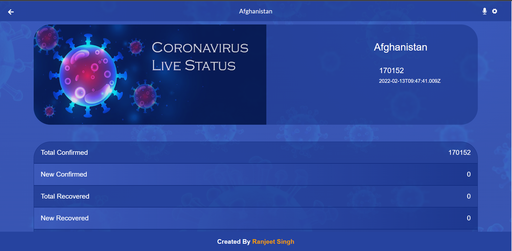

# Covid19 Metrics

> Covid19 Metrics is a web application that fectches covid data from API and renders on the screen. It shows all countries with the confirmed covid cases on the homepage, Users can select any country and goto the details page. Details page shows other details for that specific country like recovered cases, confirmed cases, deaths.

## Screenshots:

### Mobile


### Desktop




## Built With

- HTML
- CSS
- JavaScript
- REACT
- Redux
- Webpack
- Jest

## Online live link

[Visit project online](https://covid19-metrics-thecodechaser.netlify.app)

## Getting Started

To get a local copy up and running follow these simple example steps.

### Prerequisites
- A text editor(preferably Visual Studio Code)
- Node
- Web browser

### Install
- [Git](https://git-scm.com/downloads)
- [Node](https://nodejs.org/en/download/)

### Using it Locally

- Clone the project

```bash 
git clone https://github.com/thecodechaser/covid19-metrics

cd covid19-metrics
```

- Install dependencies

```bash
npm i 
or
npm install
```
- To Start the development server
```bash
npm start
```

- To test the project
```bash
npm run test
```


## Visit And Open Files

[Visit Repo](https://github.com/thecodechaser/covid19-metrics)

## Download Repo

[Download Repo](https://github.com/thecodechaser/covid19-metrics/archive/refs/heads/main.zip)

## Authors

👤 **Ranjeet Singh**

- GitHub: [@githubhandle](https://github.com/thecodechaser)
- Twitter: [@twitterhandle](https://twitter.com/thecodechaser)
- LinkedIn: [LinkedIn](https://linkedin.com/in/thecodechaser)


## 🤝 Contributing

Contributions, issues, and feature requests are welcome!

Feel free to check the [issues page](https://github.com/thecodechaser/covid19-metrics/issues).

## Show your support

Give a ⭐️ if you like this project!

## Acknowledgments

- Inspired by original design for Creative Commons by Nelson Sakwa on [Behance](https://www.behance.net/sakwadesignstudio).
- Inspiration: Microverse

## 📝 License

This project is [MIT](./MIT.md) licensed.
